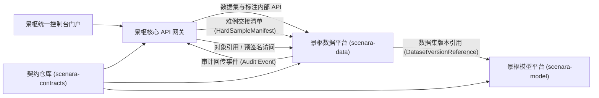
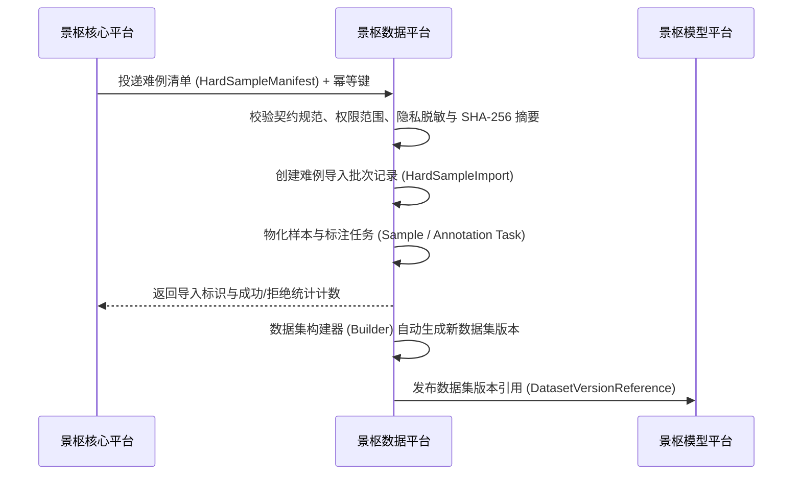

# 景枢数据管理平台承接与续建开发指南

- **文档版本：** 1.0.0  
- **目标仓库：** `scenara-data`（景枢数据平台）  
- **来源仓库：** `scenara`（景枢核心平台）  
- **上位规范：** 《景枢平台总体开发规范》`1.3.0`
- **配套文档：** 《景枢核心平台优化与数据平台拆分清单》  
- **文档状态：** 待实施  
- **编制日期：** 2026-08-15

## 修订记录

| 版本号 | 修订日期 | 主要变更说明 |
| :--- | :--- | :--- |
| 1.0.0 | 2026-08-15 | 建立数据新仓承接、迁移、续建和发布门禁指南；同步上位规范至 1.3.0 |

---

## 1. 使用场景

本文面向一个新的空白 `scenara-data` 仓库，说明如何：

1. 建立可独立运行的数据管理领域服务。
2. 消费契约仓库（`scenara-contracts`），接入核心平台的统一身份、权限、审计和统一门户。
3. 承接核心平台中现有数据集（Dataset）、数据集版本（Dataset Version）和标注（Annotation）能力。
4. 接收核心平台输出的难例清单契约（`HardSampleManifest`）。
5. 持续建设样本（Sample）、标注（Annotation）、质量（Quality）、血缘（Lineage）、构建器（Builder）、导入（Import）和导出（Export）。
6. 向模型平台（`scenara-model`）提供不可变数据集版本引用契约（`DatasetVersionReference`）。

数据平台不建设独立用户体系、API Key 系统、生产推理、模型训练或人物检索。数据平台可以建设独立前端应用，但必须通过统一设计系统、主题令牌和门户导航与核心平台保持一致接入。

---

## 2. 目标职责划分

### 2.1 数据平台负责范围
- 数据资产管理（Data Asset）
- 数据样本管理（Sample）
- 数据集目录管理（Dataset）
- 不可变数据集版本管理（Dataset Version）
- 数据集清单物化（Dataset Manifest）
- 标注任务与复核流转（Annotation / Review）
- 数据质量规则与报告（Data Quality）
- 数据血缘图谱与快照（Data Lineage）
- 难例接入与分流处理（Hard Sample Intake）
- 数据集构建器（Dataset Builder）
- 数据集离线导入与导出（Dataset Import / Export）
- 数据集跨仓访问授权（Dataset Access Grant）
- 数据集版本引用发布（DatasetVersionReference Publication）

### 2.2 数据平台不负责范围
- 核心平台的媒体、运行记录与分析结果事实来源（Core Media / Run / Result）
- 人员、轨迹与特征生产事实（Person / Track / Feature）
- 生产反馈审核决策（Feedback Review）
- 算法模型训练、评估、测试与部署
- 统一用户、组织、角色、服务账号和 API Key 凭据管理
- 建设重复的统一控制台门户、API 网关和公共 SDK

---

## 3. 总体对接架构



运行时严禁共享底层数据库。核心平台与数据平台、数据平台与模型平台只能通过已发布的规范 API、事件信封和对象引用进行解耦通信。

---

## 4. 空仓库初始化目录结构

推荐工程目录布局：

```text
scenara-data/
├── pyproject.toml              # 项目依赖与打包配置
├── README.md                   # 项目说明文档
├── src/
│   └── scenara_data/
│       ├── api/                # 接口路由与请求校验
│       ├── application/        # 应用服务与业务编排
│       ├── domain/             # 核心领域模型与标注模式
│       │   ├── datasets/       # 数据集与版本领域
│       │   ├── samples/        # 样本领域
│       │   ├── annotations/    # 标注与复核领域
│       │   ├── quality/        # 质量检验领域
│       │   ├── lineage/        # 血缘追踪领域
│       │   └── hard_samples/   # 难例交接领域
│       ├── contracts/          # 契约定义与常量
│       ├── infrastructure/     # 数据库与对象存储适配器
│       ├── observability/      # 监控指标与链路追踪
│       └── settings.py         # 配置管理
├── migrations/                 # 数据库版本迁移脚本
├── tests/                      # 自动化测试套件
│   ├── unit/                   # 单元测试
│   ├── contract/               # 契约校验测试
│   ├── integration/            # 真实基础设施集成测试
│   └── e2e/                    # 跨仓库端到端测试
├── docs/                       # 架构与规范文档
├── scripts/                    # 运维与门禁检查脚本
├── configs/                    # 契约与权限配置文件
└── deploy/                     # 容器构建与编排部署
```

第一批基础技术栈与依赖：
- Python 3.12+
- FastAPI 异步 Web 框架
- Pydantic v2 数据模型与校验
- PostgreSQL 16 关系型数据库
- Redis 7.4（用于任务队列、分布式锁和临时状态）
- S3 兼容对象存储（本地开发基准使用 MinIO）
- Alembic 数据库版本迁移工具
- pytest 自动化测试框架
- OpenTelemetry 分布式链路追踪

注：Redis 严禁持久化存储数据集、样本、标注或发布状态的业务事实数据。

---

## 5. 必须消费的核心契约清单

从契约仓库（`scenara-contracts`）锁定正式发布版本，严禁直接复制代码模型：

| 契约标识 | 数据平台角色 | 核心用途说明 |
| :--- | :--- | :--- |
| `hard-sample-handoff` | 消费方（Consumer） | 接收核心平台已批准、已授权、已脱敏的难例交接清单 |
| `dataset-version-input` | 生产方（Producer） | 向模型平台发布不可变数据集版本引用信息 |
| `object-reference` | 生产方/消费方 | 结构化引用样本媒体文件、清单文件和导出工件 |
| `api-error` | 生产方（Producer） | 返回全局统一的错误码与标准错误信封 |
| `event-envelope` | 生产方/消费方 | 发布与消费标准版本化领域事件 |
| `iam-context` | 消费方（Consumer） | 接收并解析透传的租户、项目、主体和权限范围上下文 |

---

## 6. 核心领域模型定义

### 6.1 数据集（Dataset）
包含字段：数据集标识（`dataset_id`）、租户标识（`tenant_id`）、项目标识（`project_id`）、数据集名称（`name`）、描述说明（`description`）、当前状态（`status`）、负责人主体标识（`owner_principal_id`）、业务标签（`labels`）、扩展元数据（`metadata`）、创建时间（`created_at`）、更新时间（`updated_at`）。

数据集是可变目录实体，但不得直接承载已发布的样本快照。

### 6.2 数据集版本（DatasetVersion）
包含字段：版本记录标识（`version_id`）、关联数据集标识（`dataset_id`）、版本号语义字符串（`version`）、版本状态（`status`）、清单对象引用（`manifest_ref`）、清单哈希摘要（`manifest_sha256`）、样本总数（`sample_count`）、质量报告引用（`quality_report_id`）、血缘快照引用（`lineage_snapshot_id`）、创建者（`created_by`）、创建时间（`created_at`）、发布时间（`published_at`）。

发布完成后，以下内容严格不可篡改：
- 版本号语义字符串
- 清单对象引用及其 SHA-256 哈希值
- 包含的样本集合与元数据
- 冻结的标注数据快照
- 关联的质量检验报告
- 关联的数据血缘快照

### 6.3 数据样本（Sample）
包含字段：样本标识（`sample_id`）、租户标识（`tenant_id`）、项目标识（`project_id`）、媒体类型（`media_kind`）、内容对象引用（`content_ref`）、内容哈希摘要（`content_sha256`）、来源系统（`source_system`）、来源资源类型（`source_resource_type`）、来源资源标识（`source_resource_id`）、来源引用（`source_ref`）、人员标识（`person_id`）、抓拍摄像机标识（`camera_id`）、检测边界框（`bbox`）、数据集划分（`dataset_split`：`train` / `validation` / `test` / `query` / `gallery`）、抓拍采集时间（`captured_at`）、创建时间（`created_at`）。

### 6.4 标注与复核（Annotation）
拆分为以下实体：
- 标注任务（`AnnotationTask`）
- 标注分配（`AnnotationAssignment`）
- 标注实体（`Annotation`）
- 标注修订版本（`AnnotationRevision`）
- 标注复核记录（`AnnotationReview`）
- 标注提供方（`AnnotationProvider`）

标注修订采用追加式版本记录，严禁直接物理覆盖已审核通过的标注历史。数据集版本发布时将冻结所引用的具体标注修订版本。

### 6.5 数据质量与数据血缘（Quality & Lineage）
必须建立规范实体：
- 质量检验规则（`QualityRule`）
- 质量执行运行（`QualityRun`）
- 质量问题明细（`QualityIssue`）
- 质量检验报告（`QualityReport`）
- 血缘关系边（`LineageEdge`）
- 血缘结构快照（`LineageSnapshot`）

---

## 7. 领域状态机模型

```text
数据集状态流转（Dataset）：
草稿（draft） -> 活跃启用（active） -> 已归档（archived）

数据集版本状态流转（DatasetVersion）：
草稿（draft） -> 构建中（building） -> 就绪（ready） -> 已发布（published） -> 已归档（archived）
                                \-> 构建失败（failed）

标注任务状态流转（AnnotationTask）：
待分配（pending） -> 已分配（assigned） -> 进行中（in_progress） -> 已提交（submitted） -> 审核通过（approved）
                                                                                \-> 审核驳回（rejected）
                 \-> 已取消（cancelled）

任务作业状态流转（Import/Export/Quality Job）：
排队中（queued） -> 执行中（running） -> 执行成功（succeeded）
                                    \-> 执行失败（failed）
                 \-> 已取消（cancelled）
```

状态机枚举值统一使用小写英文字符串。每次状态跃迁必须进行权限鉴权、写入不可变审计记录并产生标准领域事件。

---

## 8. 数据库设计与隔离边界

第一批核心业务数据表规划：
- `data_datasets`（数据集表）
- `data_dataset_versions`（数据集版本表）
- `data_samples`（数据样本表）
- `data_dataset_version_samples`（版本与样本关联表）
- `data_annotation_tasks`（标注任务表）
- `data_annotation_assignments`（任务分配表）
- `data_annotations`（标注表）
- `data_annotation_revisions`（标注版本表）
- `data_annotation_reviews`（标注复核表）
- `data_annotation_providers`（标注提供方表）
- `data_quality_rules`（质量规则表）
- `data_quality_runs`（质量运行表）
- `data_quality_issues`（质量问题明细表）
- `data_quality_reports`（质量报告表）
- `data_lineage_edges`（血缘边关系表）
- `data_lineage_snapshots`（血缘快照表）
- `data_hard_sample_imports`（难例导入批次表）
- `data_import_jobs`（数据导入作业表）
- `data_export_jobs`（数据导出作业表）
- `data_outbox_events`（发件箱事件表）
- `data_idempotency_records`（幂等控制记录表）

所有业务数据表必须显式包含租户标识 `tenant_id` 和项目标识 `project_id`。严禁建立跨租户外键关联与无租户范围过滤的全局查询。数据平台数据库严禁与核心平台数据库建立任何外键、外部数据包装器（FDW）或跨库视图。

---

## 9. 对象存储设计与命名空间

规划存储桶与逻辑命名空间：
- `scenara-datasets`（不可变数据集发布桶）
- `scenara-data-imports`（外部数据导入暂存桶）
- `scenara-data-exports`（数据导出工件存储桶）
- `scenara-data-manifests`（物化清单文件存储桶）
- `scenara-data-backups`（平台灾备与备份存储桶）

---

## 10. 身份、权限与审计规范

数据平台不保存用户密码与凭据。调用方必须透传合法身份上下文：
- 租户标识（`tenant_id`）
- 项目标识（`project_id`）
- 主体标识（`principal_id`）
- 主体类型（`principal_type`）
- 权限范围列表（`permission_scopes`）
- 产品授权项（`product_entitlements`）
- 请求唯一标识（`request_id`）
- 分布式追踪标头（`traceparent`）

标准权限标识设计：
- `data.dataset.create`（数据集创建）
- `data.dataset.read`（数据集读取）
- `data.dataset.update`（数据集更新）
- `data.dataset.publish`（数据集发布）
- `data.dataset.archive`（数据集归档）
- `data.sample.create`（样本创建）
- `data.sample.read`（样本读取）
- `data.annotation.create`（标注创建）
- `data.annotation.review`（标注复核）
- `data.quality.run`（执行质量检验）
- `data.lineage.read`（查询数据血缘）
- `data.import.execute`（执行数据导入）
- `data.export.execute`（执行数据导出）
- `data.hard_sample.import`（执行难例导入）

---

## 11. 内部核心 API 路由规划

### 11.1 对核心平台暴露的内部业务接口
- `POST/GET/PATCH /internal/v1/datasets`
- `POST/GET /internal/v1/datasets/{dataset_id}/versions`
- `GET /internal/v1/dataset-versions/{version_id}`
- `POST /internal/v1/dataset-versions/{version_id}/transition`
- `POST/GET /internal/v1/annotation-tasks`
- `POST /internal/v1/annotation-tasks/{task_id}/review`
- `POST /internal/v1/hard-sample-manifests`
- `GET /internal/v1/hard-sample-imports/{import_id}`

### 11.2 对模型平台暴露的跨仓接口
- `GET /internal/v1/dataset-versions/{version_id}/reference`
- `GET /internal/v1/dataset-versions/{version_id}/manifest`
- `POST /internal/v1/dataset-versions/{version_id}/access-grants`

### 11.3 运维与健康探针接口
- `GET /livez`（存活探针）
- `GET /readyz`（就绪探针，真实校验数据库与对象存储连通性）
- `GET /metrics`（Prometheus 监控指标）

---

## 12. 领域事件发布与消费

数据平台负责发布：
- `dataset.created`（数据集已创建）
- `dataset.updated`（数据集已更新）
- `dataset.archived`（数据集已归档）
- `dataset.version.created`（数据集版本已创建）
- `dataset.version.ready`（数据集版本已就绪）
- `dataset.version.published`（数据集版本已发布）
- `dataset.version.archived`（数据集版本已归档）
- `annotation.task.created`（标注任务已创建）
- `annotation.submitted`（标注已提交）
- `annotation.reviewed`（标注已复核）
- `quality.completed`（质量检验已完成）
- `quality.failed`（质量检验失败）
- `hard_sample.imported`（难例导入成功）
- `hard_sample.import.failed`（难例导入失败）

数据平台负责消费：
- `hard_sample.created`（难例创建事件或清单投递通知）

---

## 13. 难例交接与闭环流程



---

## 14. 阶段开发里程碑与发布门禁

### 里程碑规划
- **M0（工程与运行基线）**：完成工程脚手架、FastAPI、配置管理、健康探针、日志系统、CI 流水线、Compose 开发环境与迁移框架。
- **M1（契约与身份接入）**：完成契约锁定、统一错误与事件信封、核心平台身份上下文鉴权与权限拦截。
- **M2（数据集与版本构建）**：完成数据集增删改查、版本构建发布、不可变清单物化、对象引用管理与不可变审计。
- **M3（历史数据迁移导入）**：完成导出包离线导入工具、状态映射规则、影子读比对以及迁移比对报告。
- **M4（样本与标注流转）**：完成样本管理、标注多版本追加、任务分发、复核审批与第三方标注商接入。
- **M5（数据质量与血缘追踪）**：完成质量规则库、检验报告生成、血缘边记录与不可变血缘快照。
- **M6（难例交接与自动构建）**：完成难例清单接收、样本物化、标注任务自动派发与数据集自动构建。
- **M7（模型平台跨仓对接）**：完成不可变版本引用发布、访问授权签发与跨仓训练消费验证。
- **M8（生产切流与旧库退役）**：完成核心平台远程代理、全量流量切流、旧数据表置为只读与写路径安全退役。

### 首次正式发布门禁要求
1. 契约仓库版本严格锁定，兼容性回归测试 100% 通过；
2. 所有业务数据表具备多租户与多项目隔离保护；
3. 数据集版本发布后内容与清单完全不可变；
4. 对象存储读取时严格执行 SHA-256 哈希校验；
5. 核心平台身份鉴权与权限拦截测试全部通过；
6. 历史数据迁移条数、业务 ID 与哈希摘要报告完全一致；
7. 难例清单重复投递实现严格幂等处理；
8. 模型平台通过不可变引用完成数据集消费验证；
9. PostgreSQL 与对象存储备份容灾演练通过；
10. 安全渗透、静态代码分析、敏感凭据扫描全部通过；
11. 核心平台公共 API、控制台与 SDK 均无功能回归；
12. 具备经演练验证的完整回滚与应急处置预案。
