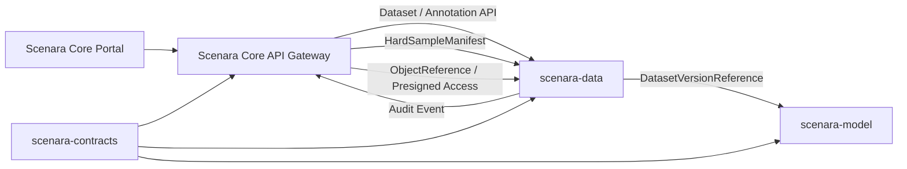
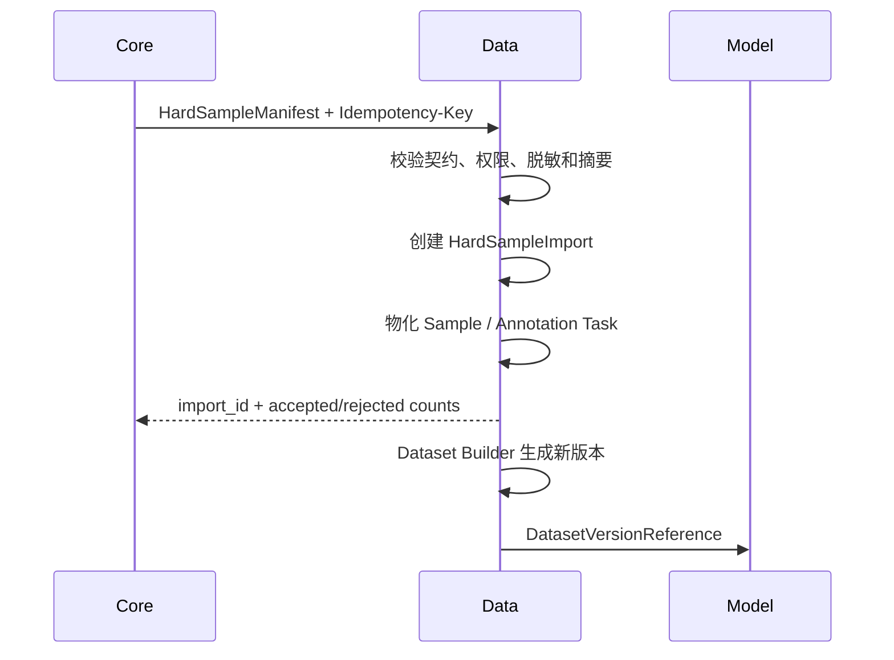

# 景枢数据管理平台承接与续建开发指南

**文档版本：** 1.0.0  
**目标仓库：** `scenara-data`  
**来源仓库：** `scenara`  
**上位规范：** `景枢平台总体开发规范.md` 1.3.0

**配套文档：** `景枢核心平台优化与数据平台拆分清单.md`  
**文档状态：** 待实施  
**编制日期：** 2026-08-15

## 修订记录

| 版本 | 日期 | 主要变更 |
| --- | --- | --- |
| 1.0.0 | 2026-08-15 | 建立 Data 新仓承接、迁移、续建和发布门禁指南；同步上位规范至 1.3.0 |

## 1. 使用场景

本文面向一个新的空白 `scenara-data` 仓库，说明如何：

1. 建立可独立运行的数据管理服务。
2. 消费 `scenara-contracts`，接入 Core 的统一身份、权限、审计和统一门户。
3. 承接 Core 中现有 Dataset、Dataset Version 和 Annotation 能力。
4. 接收 Core 输出的 HardSampleManifest。
5. 继续建设 Sample、Annotation、Quality、Lineage、Builder、Import 和 Export。
6. 向 `scenara-model` 提供不可变 DatasetVersionReference。

Data 不建设独立用户体系、API Key 系统、生产推理、模型训练或人物检索。Data 可以建设独立前端应用，但必须通过统一设计系统、主题令牌和门户导航与 Core 一致接入。

## 2. 目标职责

Data 负责：

```text
Data Asset
Sample
Dataset
Dataset Version
Dataset Manifest
Annotation / Review
Data Quality
Data Lineage
Hard Sample Intake
Dataset Builder
Dataset Import / Export
Dataset Access Grant
DatasetVersionReference Publication
```

Data 不负责：

```text
Core Media / Run / Result 事实来源
Person / Track / Feature 生产事实
Feedback 审核
模型训练、评估和部署
统一用户、角色、服务账号和 API Key 管理
第二套 Console、API Gateway 和公共 SDK
```

## 3. 总体对接架构



运行时禁止共享数据库。Core 与 Data、Data 与 Model 只能通过已发布 API、事件和对象引用通信。

## 4. 空仓库初始化

推荐目录：

```text
scenara-data/
├── pyproject.toml
├── README.md
├── src/
│   └── scenara_data/
│       ├── api/
│       ├── application/
│       ├── domain/
│       │   ├── datasets/
│       │   ├── samples/
│       │   ├── annotations/
│       │   ├── quality/
│       │   ├── lineage/
│       │   └── hard_samples/
│       ├── contracts/
│       ├── infrastructure/
│       ├── observability/
│       └── settings.py
├── migrations/
├── tests/
│   ├── unit/
│   ├── contract/
│   ├── integration/
│   └── e2e/
├── docs/
├── scripts/
├── configs/
└── deploy/
```

第一批基础依赖：

```text
Python 3.12+
FastAPI
Pydantic
PostgreSQL 16
Redis 7.4（队列、锁和临时任务状态）
S3-compatible Object Storage（基线 MinIO）
Alembic 或项目统一迁移工具
pytest
OpenTelemetry
```

Redis 不得保存 Dataset、Sample、Annotation 或发布状态的事实数据。

## 5. 第一批必须消费的契约

从 `scenara-contracts` 锁定正式版本，不得复制 Core 内部模型：

| 契约 | Data 角色 | 用途 |
| --- | --- | --- |
| `hard-sample-handoff` | Consumer | 接收 Core 已批准、已授权、已脱敏的难例 |
| `dataset-version-input` | Producer | 向 Model 发布不可变数据集版本引用 |
| `object-reference` | Producer/Consumer | 引用样本、Manifest 和导出制品 |
| `api-error` | Producer | 返回统一错误码和错误信封 |
| `event-envelope` | Producer/Consumer | 发布和消费版本化事件 |
| IAM Context | Consumer | 接收租户、项目、主体和权限范围 |

在独立 Contracts 尚未发布扩展版本前，可以使用 Core 当前 `contracts/repository/v1.0.0` 作为只读启动基线，但不得在 Data 中私自修改 Schema。

## 6. 核心领域模型

### 6.1 Dataset

建议字段：

```text
dataset_id
tenant_id
project_id
name
description
status
owner_principal_id
labels
metadata
created_at
updated_at
```

Dataset 是可变目录实体，但不得直接承载已发布样本快照。

### 6.2 DatasetVersion

建议字段：

```text
version_id
dataset_id
version
status
manifest_ref
manifest_sha256
sample_count
quality_report_id
lineage_snapshot_id
created_by
created_at
published_at
```

发布后以下内容不可变：

```text
version
manifest_ref
manifest_sha256
样本集合
标注快照
QualityReport 引用
Lineage Snapshot 引用
```

### 6.3 Sample

建议字段：

```text
sample_id
tenant_id
project_id
media_kind
content_ref
content_sha256
source_system
source_resource_type
source_resource_id
source_ref
person_id
camera_id
bbox
dataset_split
captured_at
created_at
```

人物重识别样本至少支持：

```text
image
person_id
camera_id
bbox
dataset_split: train / query / gallery
```

### 6.4 Annotation

建议拆分：

```text
AnnotationTask
AnnotationAssignment
Annotation
AnnotationRevision
AnnotationReview
AnnotationProvider
```

Annotation Revision 采用追加式版本，不覆盖已审核标注。Dataset Version 发布时冻结使用的 Annotation Revision。

### 6.5 Quality 与 Lineage

必须建立：

```text
QualityRule
QualityRun
QualityIssue
QualityReport
LineageEdge
LineageSnapshot
```

`quality_score` 和任意 `lineage JSON` 只能作为兼容输入，不得继续作为长期唯一数据模型。

## 7. 状态机

建议状态：

```text
Dataset:
draft -> active -> archived

DatasetVersion:
draft -> building -> ready -> published -> archived
                  \-> failed

AnnotationTask:
pending -> assigned -> in_progress -> submitted -> approved
                                            \-> rejected
              \-> cancelled

Import/Export/Quality Job:
queued -> running -> succeeded
                  \-> failed
        \-> cancelled
```

状态线值使用小写。每次状态转换必须检查权限、记录审计并产生必要事件。

迁移 Core 旧状态时使用显式映射：

| Core 旧状态 | Data 目标状态 |
| --- | --- |
| Dataset `draft` | `draft` |
| Dataset `active` | `active` |
| Dataset `archived` | `archived` |
| Version `draft` | `draft` |
| Version `validated` | `ready` |
| Version `published` | `published` |
| Version `retired` | `archived` |

## 8. 数据库边界

第一批表建议：

```text
data_datasets
data_dataset_versions
data_samples
data_dataset_version_samples
data_annotation_tasks
data_annotation_assignments
data_annotations
data_annotation_revisions
data_annotation_reviews
data_annotation_providers
data_quality_rules
data_quality_runs
data_quality_issues
data_quality_reports
data_lineage_edges
data_lineage_snapshots
data_hard_sample_imports
data_import_jobs
data_export_jobs
data_outbox_events
data_idempotency_records
```

所有业务表必须包含 `tenant_id` 和 `project_id`，并以数据库约束或查询封装保证隔离。禁止跨租户外键和无作用域查询。

Data 数据库不得创建到 Core 数据库的外键、视图、FDW 或跨库查询。

## 9. 对象存储边界

建议桶或逻辑命名空间：

```text
scenara-datasets
scenara-data-imports
scenara-data-exports
scenara-data-manifests
scenara-data-backups
```

Core 原始媒体位于 Core 管理的媒体对象空间。Data 有两种使用方式：

1. Draft 阶段通过受控 ObjectReference 或预签名读取来源内容。
2. Dataset Version 发布前，将样本物化到 Data 自有不可变对象空间并验证 SHA-256。

发布版本不得长期依赖可能删除、覆盖或改变授权的 Core 内部对象 key。

## 10. 身份、权限和审计接入

Data 不保存用户密码、API Key 和 Membership 事实。Data 必须验证 Core 信任的身份上下文，至少包含：

```text
tenant_id
project_id
principal_id
principal_type
permission scopes
product entitlements
request_id
traceparent
```

建议权限 ID：

```text
data.dataset.create
data.dataset.read
data.dataset.update
data.dataset.publish
data.dataset.archive
data.sample.create
data.sample.read
data.annotation.create
data.annotation.review
data.quality.run
data.lineage.read
data.import.execute
data.export.execute
data.hard_sample.import
```

Data 保存本地不可变领域审计记录和 Outbox，但平台统一审计查询由 Core 提供。Data 通过事件或审计接收 API 回传摘要，不得写 Core 审计表。

## 11. 第一批 API

### 11.1 对 Core 提供

```text
POST   /internal/v1/datasets
GET    /internal/v1/datasets
GET    /internal/v1/datasets/{dataset_id}
PATCH  /internal/v1/datasets/{dataset_id}

POST   /internal/v1/datasets/{dataset_id}/versions
GET    /internal/v1/datasets/{dataset_id}/versions
GET    /internal/v1/dataset-versions/{version_id}
POST   /internal/v1/dataset-versions/{version_id}/transition

POST   /internal/v1/annotation-tasks
GET    /internal/v1/annotation-tasks
POST   /internal/v1/annotation-tasks/{task_id}/review

POST   /internal/v1/hard-sample-manifests
GET    /internal/v1/hard-sample-imports/{import_id}
```

Core 对外继续暴露现有 `/api/v1/datasets` 和 `/api/v1/data/annotation-*`，并转发到这些内部接口。

### 11.2 对 Model 提供

```text
GET /internal/v1/dataset-versions/{version_id}/reference
GET /internal/v1/dataset-versions/{version_id}/manifest
POST /internal/v1/dataset-versions/{version_id}/access-grants
```

返回必须符合 `dataset-version-input` 契约，并包含不可变 Manifest、摘要、授权和血缘信息。

### 11.3 健康与运维

```text
GET /livez
GET /readyz
GET /metrics
```

`readyz` 必须真实检查 PostgreSQL 和必需对象存储依赖，不能始终返回成功。

## 12. 事件

Data 至少发布：

```text
dataset.created
dataset.updated
dataset.archived
dataset.version.created
dataset.version.ready
dataset.version.published
dataset.version.archived
annotation.task.created
annotation.submitted
annotation.reviewed
quality.completed
quality.failed
hard_sample.imported
hard_sample.import.failed
```

Data 至少消费：

```text
hard_sample.created 或 HardSampleManifest 投递事件
```

事件使用 Outbox，消费按 `event_id` 幂等。Webhook、消息队列或轮询只是传输实现，不得改变事件契约。

## 13. Core 现有数据迁移包

迁移包由 Core 生成，Data 导入。Data 不直接连接 Core 数据库。

建议结构：

```text
scenara-data-migration-<timestamp>/
├── migration-manifest.json
├── datasets.jsonl
├── dataset-versions.jsonl
├── annotation-providers.jsonl
├── annotation-tasks.jsonl
├── hard-sample-manifests.jsonl
├── object-references.jsonl
├── audit-references.jsonl
└── checksums.txt
```

`migration-manifest.json` 至少包含：

```text
schema_version
source_repository
source_version
generated_at
tenant/project 范围
各文件记录数
各文件 SHA-256
导出工具版本
```

Data 导入必须：

1. 验证包和文件摘要。
2. 校验 tenant/project 范围。
3. 保留 Dataset 和 Version ID。
4. 幂等处理重复导入。
5. 输出成功、跳过、冲突和失败统计。
6. 对已发布版本重新计算 Manifest 摘要。
7. 生成可归档迁移报告。

## 14. Hard Sample 承接流程



Data 不重新决定反馈是否批准。若 Manifest 未批准、未授权、未脱敏或摘要错误，必须整体拒绝或按契约明确部分接收语义。

## 15. 开发里程碑

### M0：仓库与运行基线

交付：项目结构、FastAPI、配置、探针、日志、CI、开发 Compose、PostgreSQL 迁移框架。

验收：空服务可启动；探针真实；单元测试、格式、类型检查和镜像构建通过。

### M1：契约和身份接入

交付：Contracts 锁定、错误信封、事件信封、Core 身份上下文验证、权限中间件。

验收：契约兼容测试、无权限拒绝、租户隔离和请求追踪测试通过。

### M2：Dataset 与 Dataset Version

交付：Dataset CRUD、Version 构建/发布、不可变 Manifest、对象引用和审计。

验收：发布后不能修改样本集合；重复版本拒绝；摘要验证通过。

### M3：迁移 Core Dataset

交付：Core 导出工具、Data 导入工具、状态映射、影子读比对和迁移报告。

验收：记录数、ID、版本和摘要一致；可重复导入；回滚演练通过。

### M4：Sample 与 Annotation

交付：Sample、Annotation Revision、Task、Assignment、Review、Provider。

验收：审核历史不可覆盖；权限、并发更新和版本冻结测试通过。

### M5：Quality 与 Lineage

交付：Quality Rule/Run/Report、Lineage Edge/Snapshot。

验收：Dataset Version 可以绑定固定质量报告和血缘快照。

### M6：Hard Sample 与 Dataset Builder

交付：Manifest 接收、Sample 物化、Annotation Task、Builder 和新版本生成。

验收：Core Feedback 到 Data Dataset Version 的端到端测试通过。

### M7：Model 对接

交付：DatasetVersionReference、访问授权、Manifest 下载和消费方测试。

验收：Model 可以只依赖发布契约完成训练输入准备，不读取 Data 数据库。

### M8：正式切流

交付：Core Remote Client、公共 API 代理、Console/SDK 兼容、旧表只读和退役计划。

验收：生产流量全部经过 Data；Core 不再写 Dataset/Annotation 表；恢复演练通过。

## 16. 第一批开发任务清单

建议按以下顺序创建 Issue：

1. 初始化仓库、CI、镜像、配置和探针。
2. 接入 Contracts 发布包和兼容测试。
3. 实现身份上下文、权限和租户隔离。
4. 建立 Dataset、DatasetVersion 和 Idempotency 表。
5. 实现不可变 Manifest 和对象存储 Provider。
6. 实现 Dataset/Version 内部 API。
7. 实现事件 Outbox 和统一错误码。
8. 编写 Core 迁移包导入器。
9. 在 Core 编写迁移包导出器和 DataPlatformClient。
10. 完成历史 Dataset 迁移与影子读。
11. 实现 Sample 和 Annotation 领域。
12. 实现 Quality 和 Lineage。
13. 实现 HardSampleManifest 接收和 Dataset Builder。
14. 实现 DatasetVersionReference 对 Model 输出。
15. 完成 Core API 代理、Console 和 SDK 兼容测试。
16. 完成备份恢复、安全、容量和正式切流证据。

## 17. 发布门禁

`scenara-data` 首次正式发布前必须满足：

```text
Contracts 版本锁定且兼容测试通过
所有业务表具备 tenant/project 隔离
Dataset Version 发布不可变
对象摘要读取校验通过
Core 身份和权限接入通过
迁移数据数量与摘要报告通过
Hard Sample 幂等接收通过
DatasetVersionReference 消费方测试通过
PostgreSQL 和对象存储备份恢复通过
安全、依赖和密钥扫描通过
Core 公共 API、Console 和 SDK 无回归
旧写路径回滚方案演练通过
```

未满足全部门禁时，只能标记为 `seed` 或 `implemented`，不得标记为 `production_ready`。
